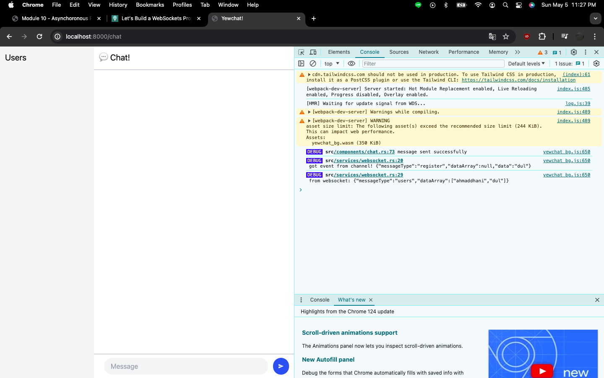
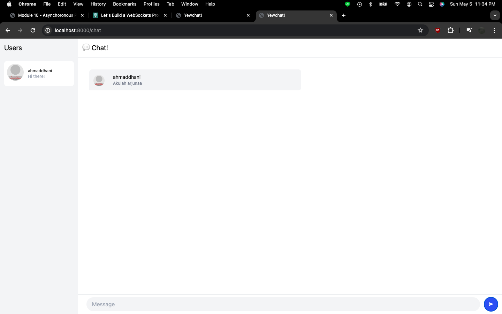

# Tutorial 10 - YewChat
AdvPro B - Marvel Martin Everthard - 2206081345

## 3.1. Original code
- _**Dari tahap awal sampai Components — Phase 2**_

- _**Hasil akhir aplikasi**_

## 3.2. Add some creativities to the webclient

Saya mengubah warna tema aplikasi chat menjadi berwarna gray dan violet. Perubahan tersebut dapat terlihat dari warna _text cursor_, _button_, dan _message bubble_ yang sekarang menjadi berwarna violet. Untuk melakukan hal tersebut, saya mengubah html pada view method yang ada di `chat.rs`.
